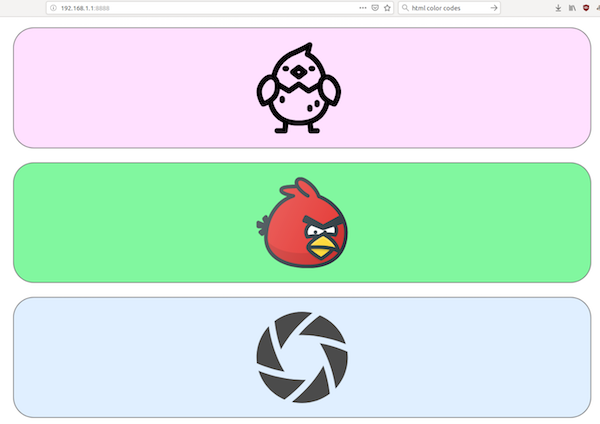

# Chicken Shot!

This plug-in is called Chicken Shot! and it plays two different bird calls from the THETA internal speaker. It is intended for having use in a chicken pen or maybe outdoors in order to catch chickens or birds doing interesting things. The plug-in is controlled by a webpage with two buttons for the bird calls and one button for taking a picture. This makes it super simple and obvious to use, which is useful when you're trying to take bird pictures.

Basically, there are three things you can do with this plug-in.

* Play two different pre-recorded bird calls using the THETA speaker. Grab the bird's attention!
* Take a 360° picture. Candid shots are the best!
* Record your own voice using the mic in your THETA and use it the same way you were using the bird calls, to attract attention and take pictures.

## How to Install

It is available on Plug-in Store.
https://pluginstore.theta360.com/plugins/theta360.meowshot/

See here for installation instruction.
https://theta360.com/en/ricoh_plugins/#install

## Usage

1. Set up to use **Chicken Shot!** plug-in. See [User Guide](https://support.theta360.com/en/manual/v/content/plugin/plugin_02.html).
2. Connect the THETA to a smartphone via Wi-Fi.
3. Long press mode button to start the plug-in. (Success if LED is White.)
4. Open plug-in's Web UI from the THETA app.

## Credits
This plug-in is based on code used in Meow Shot! created by Hideki Shiro. Thank you Shiro-san!

* [NanoHTTPD](https://github.com/NanoHttpd/nanohttpd) Copyright (c) 2012-2013 by Paul S. Hawke, 2001,2005-2013 by Jarno Elonen, 2010 by Konstantinos Togias All rights reserved.
* [theta-plugin-sdk](https://github.com/theta4j/theta-plugin-sdk) Copyright 2018 theta4j project
* The app icons are created by [ICOOON MONO](http://icooon-mono.com/).
